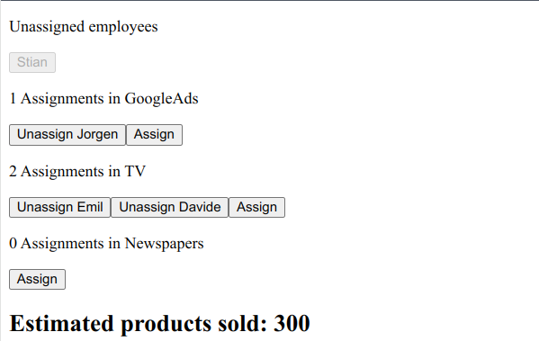
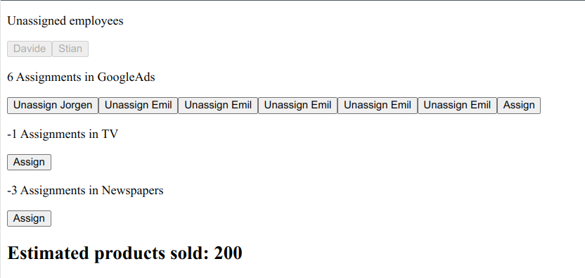

# Problem

It is late Friday afternoon, and you have just finished up the last commit for the day. As you are about to open up Hacker News for the last time today, you see an angry red notification on Slack. It is the junior engineer Julius again, who comes to you with a difficult problem he is facing when working with Employees in the Marketing simulation game. You close HN mournfully and turn to the problem at hand.

> His database schema is defined in Typescript, the database he is working with is a MongoDB database, the user interface is React and the data is transmitted over websockets to a node/express backend. The usual stuff.

He describes the problem as he understands it as follows:

Every `employee` in the simulation can either be idle or have an `assignment`. This problem concerns the marketing `employees` specifically, he says. The player can assign marketing `employees` to do marketing  tasks (writing, designing ads) for a product through various marketing channels, such as TV, newspapers and through google AdWords. Each employee you add to a channel, adds a marketing “point” to that product, which will affect how many customers buy the product. The more points it has in the channels that the customers prefer, the more sales the player gets. Students then click the "`Assign`" button beside the channel label in their interface to assign an idle employee to that channel for their product.

The students have reported that `employees` get “stuck” in assignments, or that they are unable to assign them in the first place. During your investigation, you find that there are several documents in the DB that are not being kept in sync correctly. In conversation, you also note that the students are **playing within the same company at the same time on different computers**, and possibly clicking the assign and unassign buttons at the same time as other players. This is expected, as several players usually run a company together in a group during their class. Some of the students may also be on **slow potato laptops or in an environment with unstable internet connections**.

From the player perspective, within a group, they are frustrated because when they assign `employees`, it looks like the employee was assigned, but the sales don’t turn out as expected. Sometimes all the `employees` appear in the interface as employed, even though none of the channels seem to have any “points” in them, and vica versa.

Often, they also end up assigning the same employee to the same task many times! This exploit makes them sell a lot more products. Very naughty.

> An example of a correct state

> An example of an incorrect state

In this scenario, Emil (our CEO) will also be taking home 5x his regular salary, and we can't have that.

### See the schema in `types.ts` to get a sense of how the data is modelled currently.

Separate from the `employees` and `assignments`, there is a `Product` document that keeps track of the state of the product and its marketing. The `Product`’s `marketingPoints` is updated with related code after every assignment of an employee on the server side, to reflect the number of assigned employees, but for some reason, for some companies in the simulation, the `marketingPoints` do not correctly reflect the number of assigned employees when looking at the database. The related `Assignment` document for some of the employees are also sometimes wrong. Sometimes there are more than one `Assignment` for an employee (there should only be one or zero), and sometimes an `Assignment` is missing when the `marketingPoints` indicate that an employee has been assigned. For some users, some of the `marketingPoints` even go negative, and they end up selling negative amouns of products. In theory, this would make customers return products to the company and pay them for that privilege, which would be too good a business model to allow in the simulation.

The engineer explains that it is the `Product`’s `marketingPoints` numbers that are being used for calculating customer sales, and the reason for not just counting the number of employees during sales calculations instead, is that **other simulation types on the platform are using the same property**, but don’t have employees as part of the simulation. So the `marketingPoints` object needs to stay the source of truth for sales calculations due to compatibility with other simulation types. The assignment of individual employees also needs to be tracked, to avoid employees being assigned to multiple jobs at the same time.

# Deliverable

### Primary objective
Reframe this problem in text and a simple diagram, and describe a strategy within `SOLUTION.md` to help the engineer solve the issues the players face.

### Secondary objective
Point to specific areas in the code that needs improvement and suggest changes. If you feel up to it, try to improve the demo project in this repo. Bonus points for also pointing out other areas of improvement in the code beyond the stated problem.

### Tertiary objective
Have a little fun if you can, I had fun making it.

> Submit a link to a copy of this project hosted on GitLab with your solution at the latest the day before the scheduled interview to work@hubroeducation.com or just reply to the last email I sent.

We will go through your reasoning in the technical interview.

# Caveats
The assignment feature has been implemented in this project, and you can test it out for yourself. To simulate multiple users, just open separate browser tabs.

We are not necessarily looking for technology-specific solutions to this problem, the issues faced here are relatively common to all stacks, but specific answers are welcome if you have them. If you feel you don't have enough familiarity with this stack, use examples and solutions from a stack you know better.

Note the possible causes for the bugs the students experience, the current data model and what can be improved with it, as well as strategies to mitigate the current issues on the client and server side.

**You are not expected to solve this problem fully**, only assist, explain and advise your junior engineer. I won't stop you from trying though if you feel like it, even with pseudocode.

If you see this taking a long time, you are likely too focused on the exact implementation details. Most of the solution should be possible to derive from the problem description in this README.

This problem is based on real issues we face and have dealt with. Kind of.

## Evaluation criteria
These are the criteria we look at, roughly in descending order of importance:
- Problem comprehension
- Technical understanding of the issues faced
- Structured approach and breakdown of the parts of the problem
- Communication of findings and thoughts such that a junior eng. can understand
- Outside the box thinking
- Description of general technical solutions to problems like this
- Visualization of mental model of the problem in a diagram
- Specific technical solutions related to the stack
- Improvements to the codebase, style, techniques

## Running the project

1. Clone the repository
2. Install Node (18+) and npm
3. `npm i`
4. `npm run dev`
5. Open localhost:3000